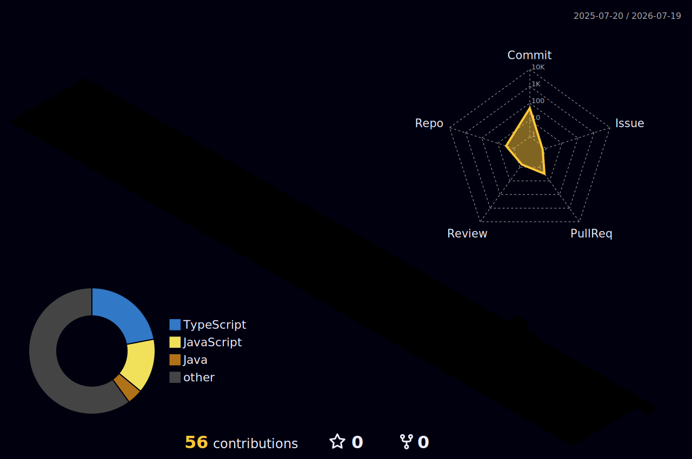

<div align="center">

#  ABDUL AZEEM 



[](https://git.io/typing-svg)

<p align="center">
  <a href="https://github.com/AbdulAzeem-10/AbdulAzeem10-codearade/actions/workflows/snake.yaml">
    
  </a>
  <a href="https://github.com/AbdulAzeem-10/AbdulAzeem10-codearade/actions/workflows/update-activity.yaml">
    
  </a>
  <a href="https://github.com/AbdulAzeem-10/AbdulAzeem10-codearade/actions/workflows/metrics.yaml">
    
  </a>
  <a href="https://github.com/AbdulAzeem-10/AbdulAzeem10-codearade/actions/workflows/profile-3d.yaml">
    
  </a>
</p>

</div>

---

## 👋 ABOUT ME

<table align="center" border="0">
  <tr>
    <td width="55%" valign="top">
      <p align="left">
        <strong>Backend-Focused Full-Stack Software Engineer</strong>
      </p>
      <p align="left">
        I'm a software engineer with a strong foundation in <strong>Backend Engineering</strong> and modern <strong>React development</strong>. Currently pursuing my <strong>BS in Computer Science at FAST-NUCES</strong>, I specialize in designing scalable APIs, building secure authentication systems, and creating responsive React applications with Redux Toolkit.
      </p>
      <p align="left">
        My core expertise includes <strong>Node.js</strong>, <strong>Express.js</strong>, <strong>NestJS</strong>, <strong>MongoDB</strong>, and <strong>PostgreSQL</strong> on the backend, alongside <strong>React.js</strong>, <strong>TypeScript</strong>, and <strong>Redux Toolkit</strong> for building modern frontends. I focus on clean code, system design principles, and delivering production-ready solutions.
      </p>
      <p align="left">
        I'm actively seeking <strong>backend engineering roles</strong>, <strong>internships</strong>, and opportunities to contribute to <strong>open-source projects</strong> that solve real-world problems.
      </p>
    </td>
    <td width="45%" valign="top" align="center">
      
    </td>
  </tr>
</table>

---

### 💼 PROFESSIONAL SUMMARY

<div align="center">

```yaml
Backend Engineering: Building RESTful APIs, Authentication Systems, Database Design
React Development: Redux Toolkit, Custom Hooks, Protected Routes, Pagination
System Design: Scalable Architecture, Clean Code Principles, Performance Optimization
Databases: MongoDB, PostgreSQL, Prisma ORM, Query Optimization
DevOps: Docker, Git, Linux, CI/CD Fundamentals
```

</div>

---

### 🎯 CURRENT MISSION

```javascript
const abdulAzeem = {
    location: "Peshawar, Pakistan 🇵🇰",
    role: "Backend-Focused Full-Stack Engineer",
    education: "FAST-NUCES (BS Computer Science)",
    primaryFocus: "Backend Engineering",
    currentWork: [
        "Building scalable REST APIs with Node.js & NestJS",
        "Designing secure authentication systems (JWT, RBAC)",
        "Developing responsive React applications with Redux Toolkit",
        "Database design and optimization (MongoDB, PostgreSQL)"
    ],
    techStack: {
        backend: ["Node.js", "Express.js", "NestJS", "RESTful APIs"],
        frontend: ["React.js", "TypeScript", "Redux Toolkit", "Tailwind CSS"],
        databases: ["MongoDB", "PostgreSQL", "Prisma", "SQL"],
        mobile: ["React Native"],
        tools: ["Git", "Docker", "Postman", "Linux"],
        architecture: ["System Design", "Clean Code", "SOLID Principles"]
    },
    learning: ["Distributed Systems", "Microservices", "AWS", "Redis", "Kafka"],
    interests: ["System Design", "Database Internals", "Cloud Architecture"],
    availability: "Open to Backend Engineering roles and internships"
};
```

<p align="center">
  
</p>

---

## 📊 GITHUB ANALYTICS

<table align="center" width="100%" border="0" cellpadding="10">
  <tr>
    <td align="center" width="50%">
      
    </td>
    <td align="center" width="50%">
      
    </td>
  </tr>
  <tr>
    <td align="center" colspan="2">
      
    </td>
  </tr>
</table>

---

## 🏆 ACHIEVEMENTS

<p align="center">
  
</p>

---

## 💻 TECH STACK

<div align="center">

### Backend Engineering (Primary Expertise)


### Frontend Development (Strong Expertise)


### Databases


### Mobile Development


### Programming Languages


### DevOps & Tools


</div>

<p align="center">
  
</p>

---

## 🔧 ENGINEERING INTERESTS

<div align="center">

```diff
+ System Design & Architecture
+ Distributed Systems
+ Database Design & Optimization
+ RESTful API Development
+ Authentication & Authorization
+ Microservices Architecture
+ Cloud Computing (AWS)
+ Performance Optimization
+ Scalable Backend Systems
+ Clean Code Principles
```

</div>

---

## 📚 LEARNING ROADMAP

<div align="center">

| Technology | Status | Priority |
|------------|--------|----------|
| Node.js & Express | ✅ Proficient | Core |
| React & Redux Toolkit | ✅ Proficient | Core |
| MongoDB | ✅ Proficient | Core |
| TypeScript | ✅ Proficient | Core |
| PostgreSQL | 🟨 Learning | High |
| NestJS | 🟨 Learning | High |
| Docker | 🟨 Learning | High |
| Prisma ORM | 🟨 Learning | Medium |
| Redis | ⬜ Planned | Medium |
| AWS (EC2, S3, Lambda) | ⬜ Planned | High |
| Kubernetes | ⬜ Planned | Medium |
| Apache Kafka | ⬜ Planned | Medium |
| GraphQL | ⬜ Planned | Low |

</div>

## 🎯 CODING PROFILES

<p align="center">
  <a href="https://leetcode.com/u/abdulazeem_10/">
    
  </a>
  <a href="https://www.hackerrank.com/abdulazeemjd">
    
  </a>
</p>

<p align="center">
  
</p>

---

## 🌐 CONNECT WITH ME

<div align="center">

### 📬 Let's Build Something Great Together

**Open to:**
- 💼 Backend Engineering Roles
- 🎯 Software Engineering Internships
- 🚀 Freelance Projects
- 🤝 Open Source Collaborations
- 💡 Technical Discussions

<p align="center">
  <a href="mailto:abdulazeemjd@gmail.com">
    
  </a>
  <a href="https://linkedin.com/in/abdul-azeem-a253b92a3">
    
  </a>
  <a href="https://github.com/AbdulAzeem-10">
    
  </a>
  <a href="#">
    
  </a>
  <a href="#">
    
  </a>
</p>

<p align="center">
  
  
</p>

</div>

---

## 🐍 CONTRIBUTION GRAPH

<picture>
  <source media="(prefers-color-scheme: dark)" srcset="https://raw.githubusercontent.com/AbdulAzeem-10/AbdulAzeem10-codearade/output/github-contribution-grid-snake-dark.svg">
  <source media="(prefers-color-scheme: light)" srcset="https://raw.githubusercontent.com/AbdulAzeem-10/AbdulAzeem10-codearade/output/github-contribution-grid-snake.svg">
  
</picture>

<details>
<summary>📊 3D Contribution Graph</summary>
<br>

<p align="center">
  
</p>

</details>

---

## 📌 FEATURED PROJECTS

<div align="center">

### 🚀 Full-Stack Applications

<table>
<tr>
<td width="50%" valign="top">

#### 💰 Expense Tracker App
Full-stack expense management system with real-time analytics

**Tech Stack:**
- **Backend:** Node.js, Express.js, MongoDB
- **Frontend:** React.js, Redux Toolkit, TypeScript
- **Features:**
  - ✔ JWT Authentication & Protected Routes
  - ✔ RESTful API with CRUD operations
  - ✔ User roles & authorization (RBAC)
  - ✔ Transaction history with pagination
  - ✔ Responsive dashboard with Tailwind CSS
  - ✔ Real-time budget tracking

<a href="https://github.com/AbdulAzeem-10">
  
</a>

</td>
<td width="50%" valign="top">

#### ♟️ Multiplayer Chess Game
Real-time chess platform with WebSocket communication

**Tech Stack:**
- **Backend:** Node.js, Express.js, Socket.io
- **Frontend:** React.js, TypeScript
- **Features:**
  - ✔ Real-time multiplayer gameplay
  - ✔ WebSocket bidirectional communication
  - ✔ Game state management with Redux
  - ✔ Move validation & chess rules engine
  - ✔ Responsive chess board UI
  - ✔ Player matchmaking system

<a href="https://github.com/AbdulAzeem-10">
  
</a>

</td>
</tr>
<tr>
<td width="50%" valign="top">

#### 💼 Portfolio Website
Modern portfolio showcasing projects and skills

**Tech Stack:**
- **Frontend:** React.js, TypeScript, Tailwind CSS
- **Features:**
  - ✔ Responsive design with animations
  - ✔ Dynamic content rendering
  - ✔ Component architecture with custom hooks
  - ✔ Performance optimized with lazy loading
  - ✔ SEO friendly structure
  - ✔ Contact form integration

<a href="https://github.com/AbdulAzeem-10">
  
</a>

</td>
<td width="50%" valign="top">

#### 🏦 Transaction System Backend
Secure banking transaction API with advanced features

**Tech Stack:**
- **Backend:** Node.js, NestJS, PostgreSQL, Prisma
- **Features:**
  - ✔ Secure REST API endpoints
  - ✔ JWT authentication with refresh tokens
  - ✔ Transaction logging & audit trails
  - ✔ Database transactions (ACID compliance)
  - ✔ Input validation & error handling
  - ✔ API documentation with Swagger

<a href="https://github.com/AbdulAzeem-10">
  
</a>

</td>
</tr>
</table>

<a href="https://github.com/AbdulAzeem-10/AbdulAzeem10-codearade">
  
</a>

</div>

<details>
<summary>📂 More Projects</summary>
<br>

### 🚀 Project Portfolio

- **E-Commerce API** - RESTful API with payment integration (Node.js, Express, MongoDB)
- **Chat Application** - Real-time messaging with Socket.io (React, Node.js, Redis)
- **Blog Platform** - Full-stack blogging system with authentication (MERN Stack)
- **Task Management API** - RESTful API with role-based access (NestJS, PostgreSQL)
- **Weather Dashboard** - React app with external API integration (React, TypeScript)
- **Algorithm Visualizer** - Interactive sorting & searching algorithms (React, TypeScript)
- **Data Structures Library** - C++ implementation of common data structures
- **Competitive Programming Solutions** - LeetCode & HackerRank solutions (C++, Python)

</details>

---

## 📝 RECENT ACTIVITY

<!--START_SECTION:activity-->
<!--END_SECTION:activity-->

<p align="center"><em>⚡ Recent GitHub activity will be displayed here automatically</em></p>

<details>
<summary>📈 Additional Stats</summary>
<br>

<p align="center">
  
</p>

<p align="center">
  
</p>

</details>

---

<div align="center">

### 💻 Backend-Focused Full-Stack Engineer

*"Building scalable systems, one commit at a time."*

<p align="center">
  <a href="https://github.com/AbdulAzeem-10?tab=repositories">
    
  </a>
</p>


</div>
